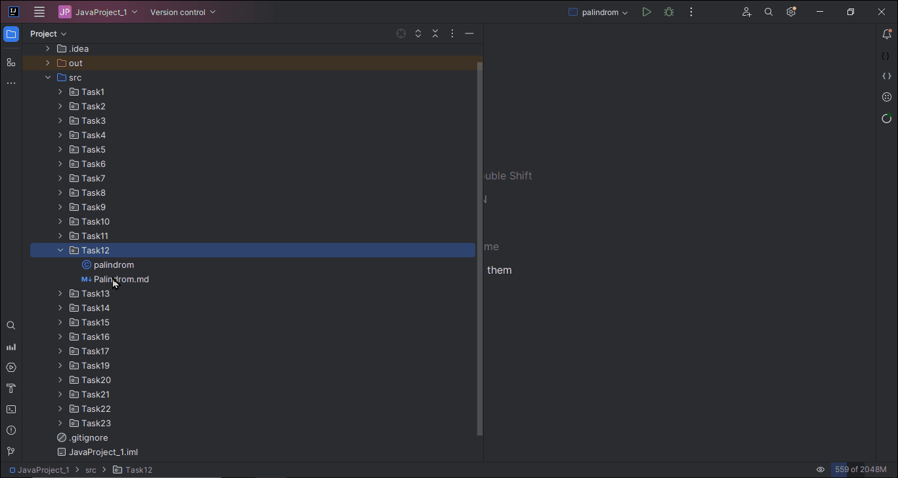

# Palindrome Check Program

A **palindrome** is a string that reads the same forward and backward. This program checks whether a given string is a palindrome.

## Program Description

1. The user will input a string.
2. A function will be created to check whether the entered string is a palindrome.
3. To check for a palindrome, compare the string with its reversed version.
4. If the string is a palindrome, display the message: `"The entered string is a palindrome."` Otherwise, display: `"The entered string is not a palindrome."`

## Function Definition

### `isPalindrome(String str): Boolean`

1. This function compares the given string with its reversed version to check if it is a palindrome.
2. Returns `true` if it is a palindrome, otherwise returns `false`.

## Example Usage

**Input:** `Kayak`  
**Output:** `The entered string is a palindrome.`

**Input:** `Is he a manager, really?`  
**Output:** `The entered string is not a palindrome.`

**Input:** `Oreo`  
**Output:** `The entered string is not a palindrome.`

