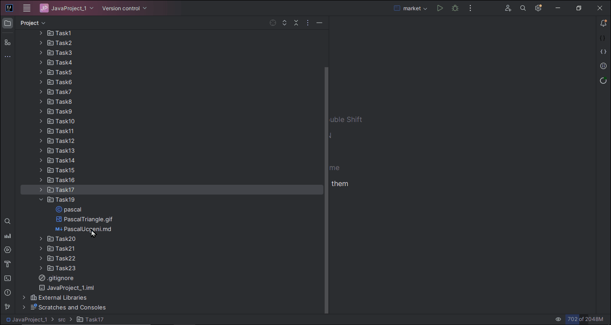

İşte verdiğiniz **Pascal Üçgeni** Java projesinin İngilizce çevirisi ve `.md` (Markdown) formatında düzgün yapılandırılmış hali:

---

```markdown
# Java Project: Pascal's Triangle

## Project Description
This project aims to generate Pascal’s Triangle.  
In Pascal’s Triangle, each number is the sum of the two numbers directly above it.  
The program will create Pascal’s Triangle with a number of rows specified by the user.

## Tasks
1. Prompt the user to enter an integer (`numRows`). This determines how many rows of Pascal's Triangle will be created.
2. Write a function that generates Pascal’s Triangle for the specified number of rows.
3. Print the Pascal’s Triangle to the console.

## Hint
- The first and last numbers in each row are always `1`.
- The first and second rows consist entirely of `1`s.
- Each number inside the triangle is the **sum of the two numbers diagonally above it** from the previous row.

## Example Output

**_Input:_**  
Enter number of rows: `5`

**_Output:_**  
Pascal's Triangle:  
```
1  
1 1  
1 2 1  
1 3 3 1  
1 4 6 4 1
```




```

---

